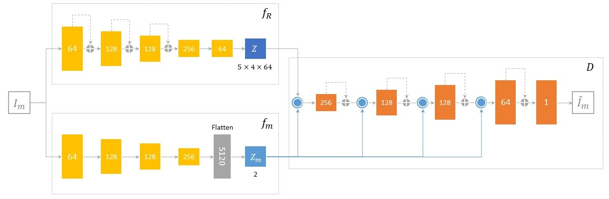

# Conditional Dual Auto-Encoders for Anomaly Detection in HEP
We use auto-encoders in an anomaly detection setting to search for SUEP (_soft unclustered energy patterns_) and SVJ 
(_semi-visible jets_) signals in a background of QCD events.

In our [paper](https://arxiv.org/abs/2306.12955) we propose a family of __Conditional Dual Auto-Encoders__ (CoDAEs) models that can learn multiple anomaly detection scores 
from raw images of particle collisions.

* There are _two encodes_: one with high capacity ($f_R$) to capture details in its large bottleneck, $Z$, and a smaller 
one ($f_m$) responsible to learn a discriminative _2-dimensional latent space_, $Z_m$, that can be directly used for anomaly detection.
* The encoder $f_m$ is learned by __conditioning__ (operation denoted by blue circles and paths in the figure) $Z$ on $Z_m$.
* Then, conditioning occurs multiple times at different resolutions of the decoder, $D$.

We can define multiple anomaly scores:
* From the **latent space**, $Z$: like the KL-divergence w.r.t. a prior, $p(Z)$.
* From the **auxiliary bottleneck**, $Z_m$, where each component can be considered as a score.
* Lastly, from the **decoder's reconstructions**: for example a score can be the reconstruction error.

---

### Code description
The repository is organized as follows:
* `ad/` contains the source code that defines layers, models, metrics, etc.
* `weights/` contains pre-trained weights.
* `data/` contains an example of the data used in our experiments.
* The notebooks `codae.ipynb`, `categorical_codvae.ipynb`, `dirichlet_vae.ipynb`, and `qcd_or_what_model.ipynb`
show the training of the respective models (and evaluation of only the latest two.) `supervised_cct.ipynb` is used to 
train the supervised classifier.
* `n_tracks.ipynb` provides a comparison of our models against both physics-based and supervised baselines.
* `tf-lite_convert.ipynb` shows how to optimize (quantize) a CoDAE model, and measure its inference time.

### Usage
Installation with virtual environment (otherwise open in, e.g., Google Colab):
1. Clone the repository: `git clone https://github.com/Luca96/dark-autoencoders.git`.
2. Change directory: `cd dark-autoencoders\`.
3. Create the virtual environment (named "venv"): `python -m venv venv`.
4. Activate it: `venv/Scripts/activate` (Windows) or `venv/bin/activate` (UNIX).
5. Install dependencies: `pip install -r requirements.txt`.
6. (optional) Install Jupyter notebook (or lab): `pip install notebook` or `pip install jupyterlab`.
### Citation
Please consider citing our paper, if using any of the provided code and approach in your own research or project.

```bibtex
@article{anzalone2023triggering,
  title={Triggering Dark Showers with Conditional Dual Auto-Encoders},
  author={Anzalone, Luca and Chhibra, Simranjit Singh and Maier, Benedikt and Chernyavskaya, Nadezda and Pierini, Maurizio},
  journal={arXiv preprint arXiv:2306.12955},
  year={2023}
}
```